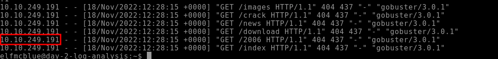

### Use the ls command to list the files present in the current directory. How many log files are present?

```bash
ls |wc -l
```

:::note
2
:::

### Elf McSkidy managed to capture the logs generated by the web server. What is the name of this log file?

:::note
webserver.log
:::

### On what day was Santa's naughty and nice list stolen?

Inside the webserver.log we can identify that the attacks happened on `18.11.2022` meaning:

:::note
Friday
:::

### What is the IP address of the attacker? 



:::note
10.10.249.191
:::

### What is the name of the important list that the attacker stole from Santa?

Search for `Santa` and `List` with grep results in:

```bash
grep "santa" webserver.log |grep list
```

:::note
santaslist.txt
:::

### Look through the log files for the flag. The format of the flag is: THM{}

```bash
grep -ri "thm{" .
```

r -> recursive

i -> ignore case

. -> local folder

:::note
THM{STOLENSANTASLIST}
:::

\


