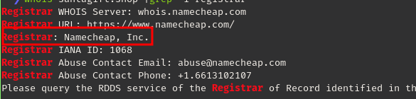

### What is the name of the Registrar for the domain santagift.shop?



```bash
whois santagift.shop |grep -i registrar
```

:::note
Namecheap Inc
:::

### Find the website's source code (repository) on [github.com](https://github.com/) and open the file containing sensitive credentials. Can you find the flag?

Repo link

[Resource Link](https://github.com/search?q=santagiftshop)


:::note
{THM\_OSINT\_WORKS}
:::

### What is the name of the file containing passwords?

:::note
config.php
:::

## What is the name of the QA server associated with the website?

In the `README.md` description shows:

:::note
`qa.santagift.shop`
:::

### What is the DB\_PASSWORD that is being reused between the QA and PROD environments?

Inside the `config.php` website we can find the DB\_PASSWORD variable with the value:&#x20;

:::note
S@nta2022
:::
