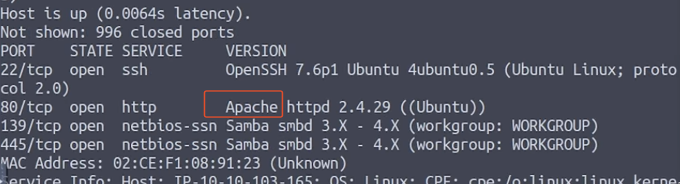
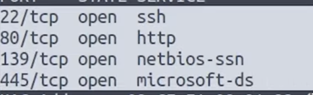
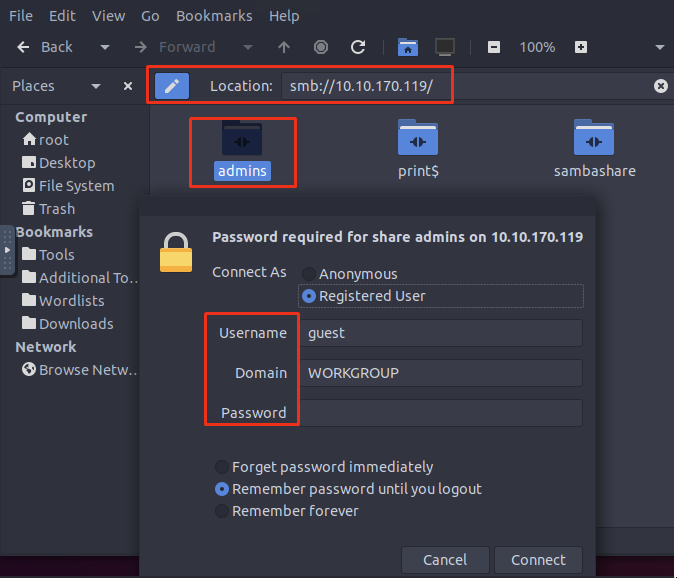
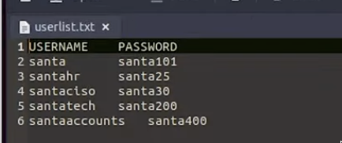

### What is the name of the HTTP server running on the remote host?

```bash
nmap -sV 10.10.103.165
```



:::note
Apache
:::

### What is the name of the service running on port 22 on the QA server?



:::note
SSH
:::

### What flag can you find after successfully accessing the Samba service?



* Username: ubuntu
* Password: S@nta2022

:::note
{THM\_SANTA\_SMB\_SERVER}
:::

### What is the password for the username santahr?



:::note
santa25
:::
