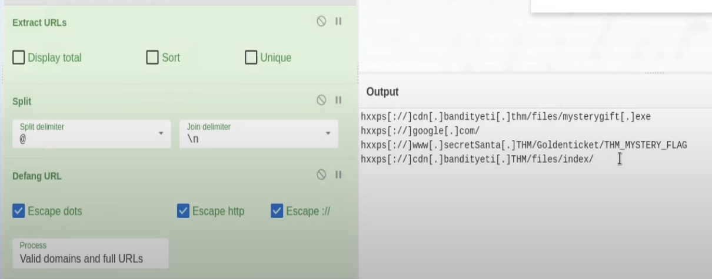

[Resource Link](https://gchq.github.io/CyberChef/)

### What is the version of CyberChef found in the attached VM?

:::note
9.49.0
:::

### How many recipes were used to extract URLs from the malicious doc?

1. strings
2. Find / Replace
3. Drop bytes
4. From base64
5. Decode text
6. Find/Replace (to remove patterns)
7. Find/Replace
8. Extract URLs
9. Split
10. Defang URL

:::note
10
:::

### We found a URL that was downloading a suspicious file; what is the name of that malware? 

Last step will solve the next 3 questions

:::note
mysterygift.exe
:::

### What is the last defanged URL of the bandityeti domain found in the last step?

:::note
hxxps\[://]cdn\[.]bandityeti\[.]THM/files/index/
:::

### What is the ticket found in one of the domains? (Format: Domain/\<GOLDEN\_FLAG>)

:::note
THM\_MYSTERY\_FLAG
:::
